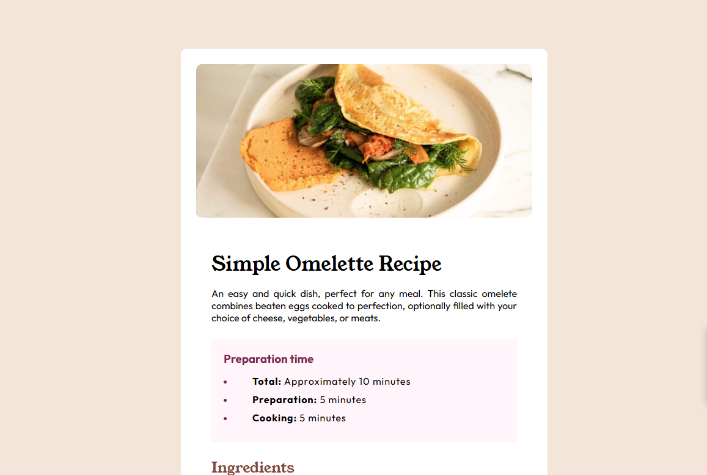

# Frontend Mentor - Desafio Recipe Page

Solução do desafio [Recipe Page do Frontend Mentor](https://www.frontendmentor.io/challenges/recipe-page-KiTsR8QQKm).

## Conteúdo

- [Visão geral](#visão-geral)
  - [Print](#print)
  - [Links](#links)
- [Processo](#processo)
  - [Linguagens](#linguagens)
  - [Aprendizado](#aprendizado)
  - [Desenvolvimento](#desenvolvimento)
  - [Recursos úteis](#recursos-úteis)
- [Autor](#autor)
- [Agradecimentos](#agradecimentos)

**Note: Delete this note and update the table of contents based on what sections you keep.**

## Visão Geral

### Print



### Links

- Repositório URL: (https://github.com/mhrsh/fem-recipe-page)

## Processo

### Linguagens

- HTML5
- CSS
- Flexbox


### Aprendizado

Pelo primeiro projeto em que codei sozinho, aprendi e apliquei muitas funções das quais eu só tinha visto teoricamente.
Uma das dificuldades foi a customização de marcadores, que utilizei a propriedade CSS:

```css
ul ::marker,
ol ::marker {
    color: hsl(14, 45%, 36%);
    font-weight: bold;
}
```


### Desenvolvimento

Pretendo continuar aprimorando funções e propriedades diferentes do CSS, já que foi a parte em que mais gastei tempo. Funções como table, pseudo-classes, pseudo-elementos, e outras.

### Recursos úteis

- [Resumos DevQuest](https://ruddy-paperback-436.notion.site/Resumos-DevQuest-ced92874b2b44d4ab9df1ab23cfa7e3c?pvs=4) - Resumos das aulas do curso DevQuest, me auxiliaram praticamente no projeto todo, lembrando as propriedades e funções, onde e como utilizar.
- [W3 Schools](https://www.w3schools.com/) - O site me ajudou com informações para formatação de bordas e tabelas.

## Autor

- Github - [mhrsh](https://github.com/mhrsh)
- Frontend Mentor - [@mhrsh](https://www.frontendmentor.io/profile/mhrsh)

## Agradecimentos

Agradeço a monitoria do curso DevQuest e aos colegas de curso, que me auxiliaram com dicas para desenvolver melhor o projeto.
